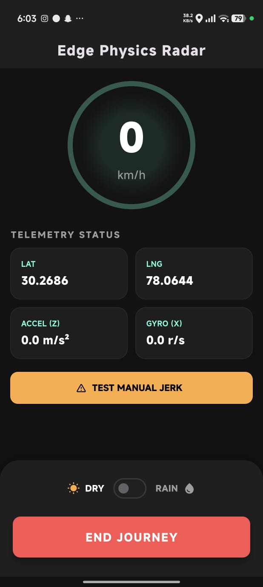
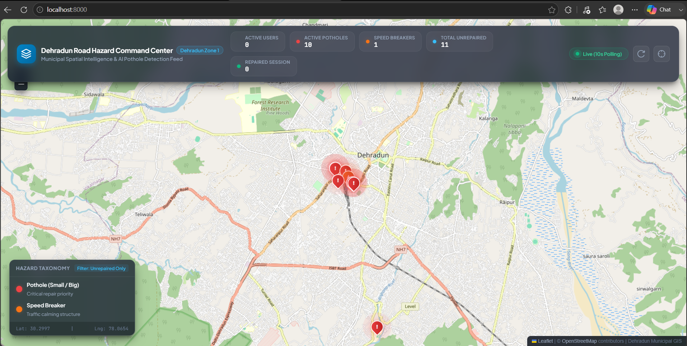
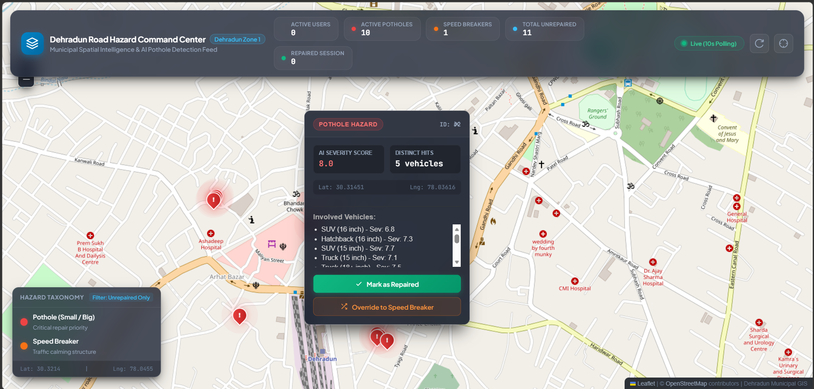

<div align="center">

# 🛰️ RADAR
### Physics-Informed Edge Telemetry & Road Hazard Warning System

**A full-stack municipal IoT platform that turns everyday commuters' phones into a distributed road-sensing network — detecting, classifying, and tracking potholes and speed breakers in real time.**

[](https://flutter.dev)
[](https://fastapi.tiangolo.com)
[](https://postgis.net)
[](https://scikit-learn.org)

[](LICENSE)
[](https://github.com/joshi-akash/pothole-detector-reporter/issues)
[](https://github.com/joshi-akash/pothole-detector-reporter/stargazers)
[](CONTRIBUTING.md)

</div>

---

## 📖 Overview

**RADAR** (Physics-Informed Edge Telemetry & Road Hazard Warning System) is a crowdsourced road-safety platform. Instead of relying on expensive dedicated survey vehicles or manual municipal audits, RADAR treats every vehicle-mounted smartphone as an edge-computing sensor node.

Raw accelerometer and gyroscope signals are processed **on-device**, physically filtered to isolate the "jerk" signature of a pothole impact from routine vehicle motion, and streamed as lightweight telemetry to a spatially-aware backend. There, a machine learning pipeline scores severity, clusters independent reports into validated hazards, and surfaces them — first to nearby drivers as a live radar warning, and second to municipal workers as an actionable repair queue.

> 🎯 **The core idea:** noisy sensor data + physics-informed filtering + spatial clustering = high-confidence, low-cost road infrastructure intelligence.

---

## 🏗️ System Architecture

```
┌─────────────────────────┐        ┌──────────────────────────┐        ┌─────────────────────────┐
│   📱 Mobile Edge Client  │  HTTP  │   ☁️ Cloud Backend        │  SQL   │  🗺️ Spatial Database     │
│   Flutter / Dart         │ ─────► │   FastAPI (ASGI)          │ ─────► │  PostgreSQL + PostGIS    │
│   Isolate-based sensing  │        │   ML Inference + DBSCAN   │        │  GeoAlchemy2 / SRID 4326 │
└─────────────────────────┘        └──────────────────────────┘        └─────────────────────────┘
                                                 ▲
                                                 │ polling
                                                 │
                                    ┌──────────────────────────┐
                                    │  🖥️ Admin Dashboard       │
                                    │  Vanilla JS + Leaflet.js  │
                                    └──────────────────────────┘
```

RADAR is composed of four independently deployable components living in this monorepo:

| Component | Path | Stack | Responsibility |
|---|---|---|---|
| 📱 **Mobile Edge Client** | `/mobile_client` | Flutter / Dart | On-device signal processing, telemetry capture, live radar UI |
| ☁️ **Cloud Backend** | `/cloud_backend` | FastAPI, Python | Ingestion API, ML inference, spatial clustering jobs |
| 🗺️ **Spatial Database** | PostgreSQL | PostGIS, GeoAlchemy2 | Persistent geospatial storage and querying |
| 🖥️ **Admin Dashboard** | `/front` | HTML / JS / Leaflet.js | Municipal-facing hazard map and repair workflow |

---

## 🔬 Technical Deep Dive

### 📱 Mobile Edge Client — *Flutter/Dart*

The mobile client is the sensing layer of RADAR, designed to do meaningful signal processing **before** a single byte hits the network.

- **Background Edge Computing via Dart Isolates** — Sensor polling and filtering run on a dedicated `Isolate`, completely decoupled from the UI thread, so the app stays fluid even while continuously crunching 50Hz sensor data in the background.
- **High-Frequency Sensor Fusion** — Polls the accelerometer and gyroscope at **50Hz**, giving fine-grained resolution on sudden vertical impacts and rotational disturbances characteristic of a pothole strike.
- **Exponential Moving Average (EMA) Filtering** — Raw accelerometer readings contain a constant ~9.8 m/s² gravity component plus vehicle-motion noise. An EMA filter continuously estimates and subtracts this baseline, isolating the **dynamic vertical jerk** — the sharp, transient signal that indicates a wheel dropping into (or bouncing off) a hazard.
- **Lightweight 3D Telemetry Uplink** — Only the distilled physics features (not raw sensor streams) are transmitted, minimizing bandwidth and battery cost while preserving detection accuracy.
- **Weather-Adaptive Radar Cone** — Integrates the **OpenWeather API** to detect wet vs. dry road conditions and dynamically resizes the hazard-warning radar cone shown to the driver — wet roads warrant earlier, wider warnings due to reduced reaction margin and hydroplaning risk.

### ☁️ Cloud Backend — *FastAPI & Python*

An **asynchronous ASGI server** built for high-concurrency telemetry ingestion from thousands of simultaneous mobile clients without blocking on I/O. FastAPI's async request handling keeps ingestion latency low even under bursty crowdsourced load, while background tasks handle the heavier ML and clustering workloads independently of the request/response cycle.

### 🗺️ Spatial Database — *PostgreSQL + PostGIS*

All geospatial persistence runs through **PostGIS**, mapped into Python via **GeoAlchemy2** for clean ORM-level geometry handling.

- **Coordinate Standard** — Every stored coordinate uses **WGS 84 (`SRID 4326`)**, the global standard also used by GPS, ensuring compatibility with any downstream mapping tool.
- **`ST_DWithin`** — Powers fast spatial bounding-box queries, used to efficiently answer "what hazards exist within N meters of this driver?" without scanning the entire hazards table.
- **`ST_Azimuth`** — Computes directional bearing between points, enabling the **directional radar cone**: RADAR only warns drivers about hazards ahead of their direction of travel, not behind them.

### 🤖 Machine Learning — *Scikit-Learn*

RADAR runs two distinct ML processes with different goals — instant per-event scoring, and periodic multi-report validation.

| Task | Algorithm | Trigger | Purpose |
|---|---|---|---|
| **Severity Scoring** | `GradientBoostingRegressor` | Real-time, per ingest | Scores each hazard event 1–10 from `[peak_jerk, dsr, r_gyro]` |
| **Spatial Clustering** | `DBSCAN` | Background job, every 60s | Groups raw points within an 8m radius into validated hazards |

- **Severity Scoring** — A `GradientBoostingRegressor` is loaded into memory once at server startup (avoiding reload overhead per-request) and scores every incoming telemetry event using a 3-feature vector: `peak_jerk` (impact magnitude), `dsr` (dynamic-to-static ratio), and `r_gyro` (rotational disturbance). The output is a normalized severity score from **1 (minor)** to **10 (severe)**.
- **Spatial Clustering & False-Alarm Filtering** — A background job runs every **60 seconds**, applying **DBSCAN** to cluster raw telemetry points within an **8-meter radius**. This is what separates RADAR from naive crowdsourcing: a single device's phantom reading (a pothole hit, a dropped phone, a speed bump misclassified) is filtered out as noise, while a hazard independently corroborated by **multiple distinct devices** is promoted to a validated, map-visible infrastructural hazard.

### 🖥️ Admin Dashboard — *Vanilla HTML/JS & Leaflet.js*

A deliberately lightweight, dependency-minimal static web interface — no heavy frontend framework, just clean JS polling the backend API. Built for municipal operators, it:

- Plots all active, DBSCAN-validated hazards on an interactive **Leaflet.js** map
- Surfaces live user/telemetry metrics for system health monitoring
- Lets municipal workers mark potholes as **repaired**, removing them from the active hazard feed and closing the loop between citizen-sourced detection and real-world civic action

---

## 📸 Screenshots

<div align="center">

**Mobile App — Live Radar UI**



**Municipal Admin Dashboard**

| Overview Map | Mark Pothole as Repaired |
|:---:|:---:|
|  |  |
| Live hazard map with real-time severity markers and user metrics | One-click workflow for municipal workers to close out fixed hazards |

</div>

---

## 📦 Get the App

Don't want to build from source? The `main` branch ships a ready-to-install build.

> 📁 Navigate to the [`apk/`](apk/) folder on the `main` branch and download the compiled **Android APK** for immediate installation on your device. *(You may need to enable "Install from unknown sources" in your Android settings.)*

---

## 🚀 Local Setup & Installation

Follow these steps to run the full RADAR stack — database, backend, dashboard, and mobile client — on your local machine.

### 1️⃣ Database — PostgreSQL + PostGIS

```bash
# Start your local PostgreSQL service, then connect and create the database
psql -U postgres

CREATE DATABASE radar_db;
\c radar_db

-- Enable the PostGIS spatial extension
CREATE EXTENSION postgis;
```

### 2️⃣ Backend — `/cloud_backend`

```bash
cd cloud_backend

# Create and activate a virtual environment
python -m venv venv
source venv/bin/activate      # On Windows: venv\Scripts\activate

# Install dependencies
pip install -r requirements.txt

# Train and cache the initial ML model
python train_dummy.py

# Launch the FastAPI server with hot-reload
uvicorn main:app --reload
```

The backend should now be live at `http://127.0.0.1:8000` 🎉

### 3️⃣ Admin Dashboard — `/front`

```bash
cd front

# Serve the static dashboard locally
python -m http.server 8080
```

Open `http://localhost:8080` in your browser to view the live hazard map.

### 4️⃣ Mobile Client — `/mobile_client`

```bash
cd mobile_client

# Fetch Flutter dependencies
flutter pub get

# Run on a connected emulator/device
flutter run
```

> 💡 **No Flutter environment set up?** Skip this step entirely and install the pre-compiled build from the [`apk/`](apk/) folder instead.

---

## 🗂️ Repository Structure

```
pothole-detector-reporter/
├── apk/                  # 📦 Pre-compiled Android APK (main branch)
├── cloud_backend/        # ☁️ FastAPI server, ML models, spatial clustering jobs
├── front/                # 🖥️ Admin dashboard (HTML/JS + Leaflet.js)
├── mobile_client/        # 📱 Flutter edge-computing mobile app
├── screenshots/          # 📸 App & dashboard UI screenshots
└── README.md
```

---

## 🧭 Roadmap

- [ ] iOS support for the mobile edge client
- [ ] Push-notification-based hazard alerts
- [ ] Historical trend analytics for municipal reporting
- [ ] Multi-city / multi-tenant dashboard support

---

## 🤝 Contributing

Contributions are what make open-source civic tech thrive. Whether it's improving the DBSCAN tuning, hardening the ingestion API, or refining the mobile UI — all contributions are welcome.

1. Fork the repository
2. Create your feature branch (`git checkout -b feature/amazing-feature`)
3. Commit your changes (`git commit -m 'Add some amazing feature'`)
4. Push to the branch (`git push origin feature/amazing-feature`)
5. Open a Pull Request

Please open an issue first for major changes so we can discuss direction before you invest the effort. 🙏

---

## 📄 License

Distributed under the **MIT License**. See `LICENSE` for more information.

---

<div align="center">

**Built to make roads safer, one crowdsourced sensor reading at a time.** 🛣️

⭐ If RADAR is useful to you, consider starring the repo!

</div>